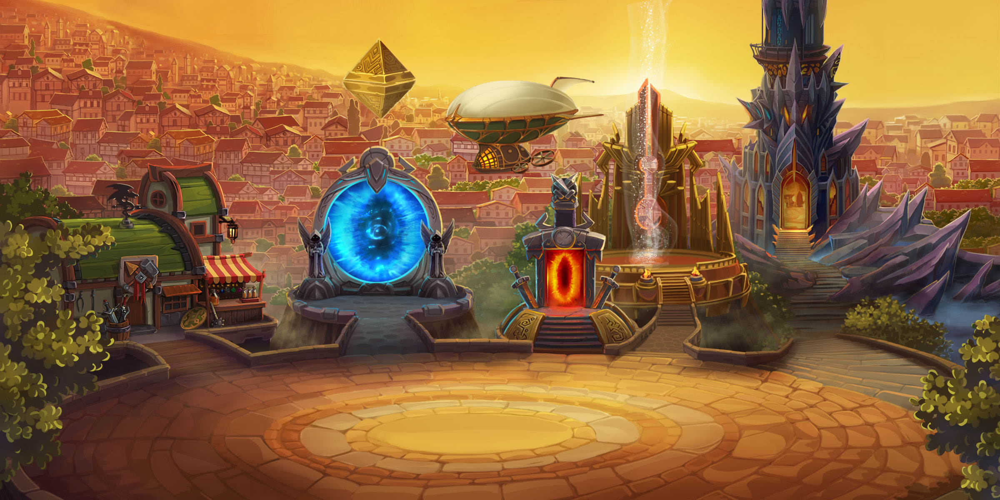
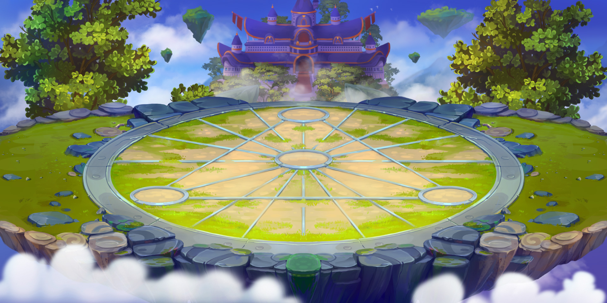
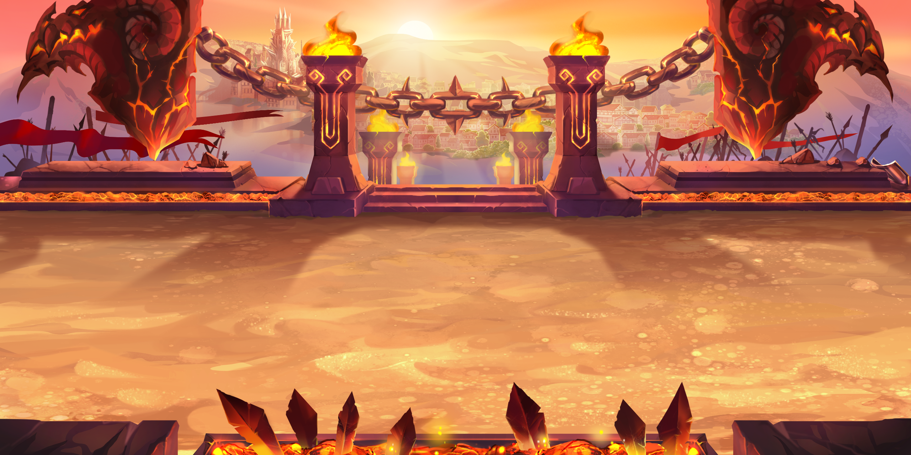

# `latest`

* **Send logging messages to Telegram (experimental)**
* **Support tower full skip for the 130th level**
* **Switch response classes to `pydantic`**
* Improve packaging, remove `--log-file` option and improve Docker integration
* Use `ujson` instead of `json`
* Update resources
* Use `loguru` for logging and improve testing

# `2.3`

* Fix possible bug with grand arena enemy selection and/or logging
* Use last `N` battles for training
* Update `User-Agent`
* Upgrade `click` package

# `2.2`

* **Buy things by their names**
* **Raid missions by their names**
* **`grand_generations_cool_down` setting instead of `grand_generations`**
* Embed IPython
* Switch back to plain old `requirements.txt`
* Fix `--help`
* Use `pydantic` for response classes
* Make tasks parameterless
* Add shop #11
* Revert model without power features
* Refresh clan ID before running arena
* Improve arena logging

# `2.1`

* **Option to randomize grand arena defenders**
* **Add `grand_generate_solutions` and `grand_keep_solutions` options**
* Add required parameter to `friendsSendDailyGift`
* Update `User-Agent` and resources
* Add new features and improve prediction quality
* Remove de-duplication of battles (not needed anymore), filter out battles without hero powers
* Change logging format, remove emoji's
* Change `open_titan_artifact_chest` time
* Make `secretary_max` choose better _or equal_

# `2.0`

**Breaking change.** As I keep adding more and more configuration options, I decided to move them out from the command line and environment variables to a separate configuration file. If you upgraded to this version, make sure you properly move your settings.

* **Introducing configuration file**
* **Configure maximum number of arena pages during enemy search**
* **Configure the model hyper-parameters**
* Distribute stamina evenly between heroic missions

# `2.0b`

* **Fix forever cached user info**
* **Farm shops #8 and #10**
* **Option to skip particular clans in arena**
* **Open titan artifact chests**
* Improve logging code
* Upgrade to Python 3.7
* Upgrade game resources
* Improve parameters validation

# `1.2`

* **Raid bosses**
* Fix offer farming

# `1.1`

* Farm offers
* Simplify expeditions code
* Check expeditions more frequently
* Gracefully handle offer farm error
* Update resources

# `1.0` «It's 1.0»

* **Completely redesign raids – spend all stamina**
* Optimise grand arena by keeping the best solutions during the entire search process
* Update translations
* Fix `ValueError: max() arg is an empty sequence` in arena
* Add `SPAM` logging level
* Allow stopping the hyper-parameters search process with Command+C

# `0.5` «Playground»

* Use `3.6.5-wee` docker image
* Switch to `pipenv`
* Add `ARENA_EARLY_STOP` parameter
* Add `GRAND_ARENA_GENERATIONS` parameter
* Add `ARENA_TEAMS_LIMIT` parameter
* Add `FRIENDS` parameter
* Model trainer is now using T-test to compare scores – it should decrease `n_estimators` and improve speed
* Caching selected arena attackers during the search
* Vacuum the database after training
* Delete `test` branch

# `v0.4.1`

* Stability improvements and game translations update

# `v0.4` «Arena Time»

* **Automatic arena model training**
* **Battle logs are moved to SQLite**
* **Configurable VK.com token**
* `BESTMOBABOT_ARENA_OFFSET` option to shift arena schedule
* TinyDB is replaced with SQLite
* Added early stop to arena enemy selection, early stop improvements
* Generated model is removed from the codebase
* Hardcoded VK.com token is revoked
* Workaround to speed up arena computations
* Save hero powers in the battle log
* Update game locale to `v0351`
* Shift raid schedules over day
* Add mirrored battles to the training data set

# `v0.3.1`

* Stability improvements and model updates

# `v0.3`

* Grand arena with predictive model
* Trainer command
* Shopping
* Stability improvements

# `v0.2` «Machine Learning»

* Bot is able to use the prediction model to attack the best arena enemy

# `v0.1`

* The first pre-release that is more or less stable and performs common everyday tasks
